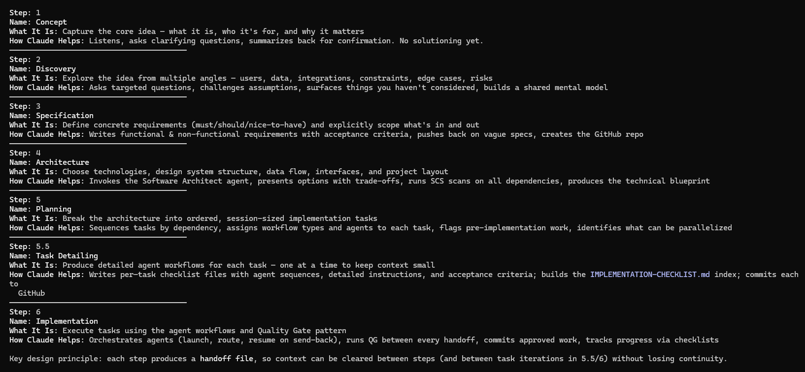
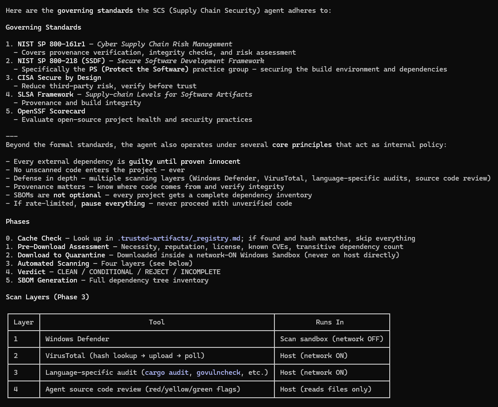
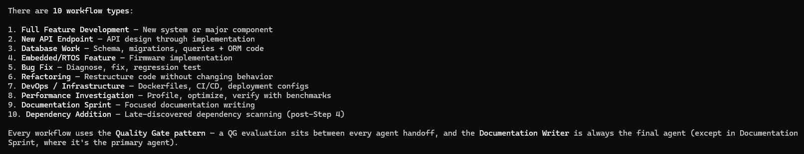
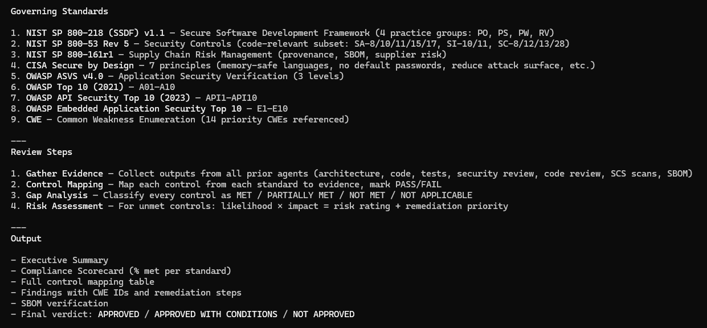
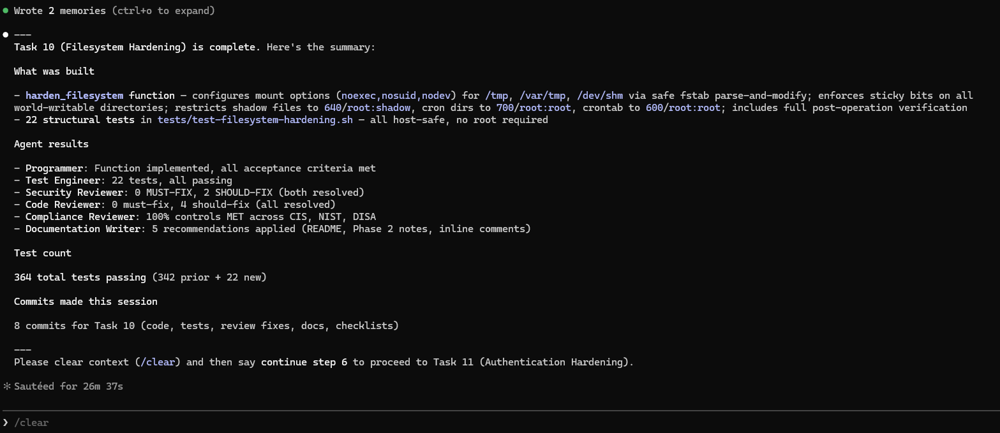
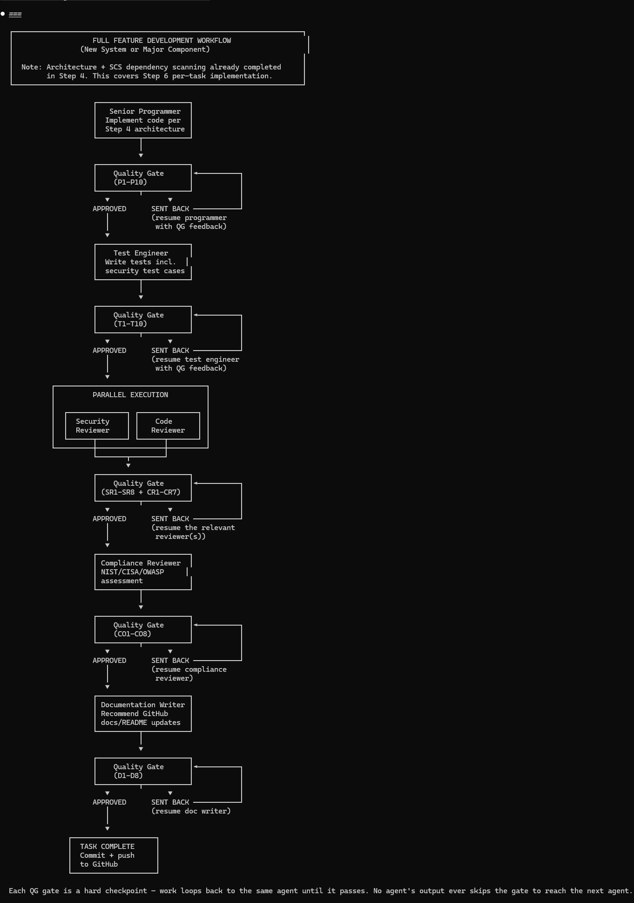

# Claude Code Project Workflow

A structured, agent-driven workflow system for [Claude Code](https://docs.anthropic.com/en/docs/claude-code) that guides projects from concept to working code — entirely from the terminal.

It uses a **7-step process** that breaks down software development into focused phases, each with specialized agent support:

## Why Pro or Max?

A Claude Code **Pro** subscription is recommended at minimum, with **Max** being ideal. Steps 4 and 6 involve significant agent workloads that benefit from higher usage limits:

- **Step 4 (Architecture)** uses a Supply Chain Security agent that runs a 6-phase, 4-layer security scan on all external dependencies using a sandboxed approach.

- **Step 6 (Implementation)** executes tasks using an agent workflow design with 10 workflow types to match different task needs.

  Step 6 also employs a **Compliance Reviewer** agent where necessary, mapping code against NIST, CISA, OWASP, and CWE standards:

## How Implementation Works

During Step 6, any issues found by agents are sent back to the appropriate agent for rework. The reworked code then passes back through the review chain until all work satisfies the requirements. All agent IDs are kept active during the entire task to preserve context in case of rework. Claude only orchestrates — all work is done by agents with specialized roles.

**Example task completion output:**

**Example workflow: Full Feature Development**

Each Quality Gate is a hard checkpoint — work loops back to the same agent until it passes. No agent's output ever skips the gate to reach the next agent.

## Getting Started

See [SETUP.md](SETUP.md) for installation instructions — it's a single script that configures everything automatically.

## License

This project is licensed under the [MIT License](LICENSE).
